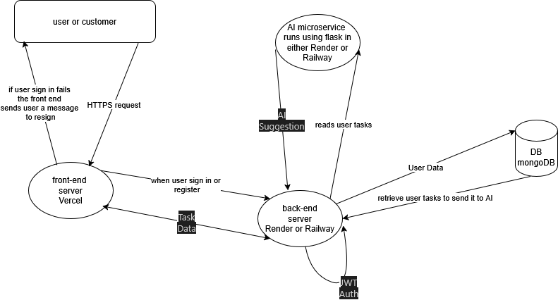

# Tasky: Your Personal AI-Powered Task Manager

## Project Overview
Tasky is a web-based application that helps users manage daily tasks with AI-powered suggestions based on deadlines, priorities, and importance. The project is designed to provide hands-on experience in full-stack development, system design, authentication, testing, deployment, and documentation.

## System Architecture
Below is the system architecture diagram. Please add your diagram image file (e.g., architecture.png) to the project folder and update the image link below:

*Replace 'architecture.png' with your actual file name if different.*

## Features
- User registration and login
- Task management (add, edit, delete, view)
- AI-powered task suggestions
- Responsive frontend
- RESTful API
- Secure user data handling
- Unit testing and debugging
- Free cloud deployment
- Documentation and version control

## Tech Stack
- Frontend: React (JavaScript)
- Backend: Node.js + Express
- Database: MongoDB
- AI/ML: Python Flask microservice
- Authentication: JWT
- Version Control: Git & GitHub
- Deployment: Vercel (frontend), Render/Railway (backend)
